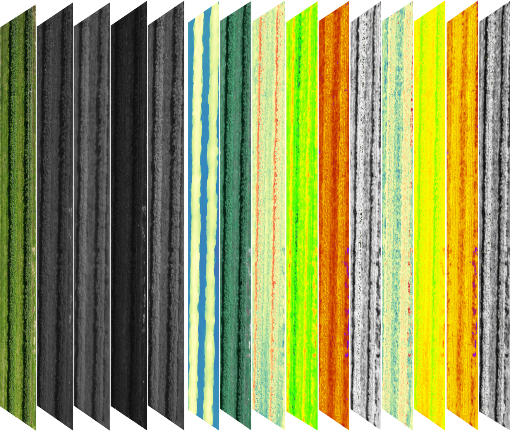

### `Data pre-processing and analysis of the results obtained in Pix4Dfields`
This repository contains mutlispectral data of the study 
“Impact of Biostimulants Foliar Applications on Primocane Raspberries Assessed Using UAV-Based Multispectral Imaging”

## Citation
If you use this repository, please cite:
